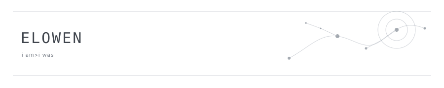

  

I build small AI systems around a question I keep returning to: **what does a model need beyond the model itself?**

Right now that means long-term memory, retrieval, tool use, agent infrastructure, and the less glamorous engineering required to make them actually work together.

### Selected work

**[Nocturne](https://github.com/elowen1221/Nocturne)**  
Long-term memory infrastructure for LLM agents.

Structured memory units, hierarchical recall, lifecycle management, provenance-preserving storage, and controlled maintenance — exposed to agents through an OAuth-protected MCP interface.

`Python` · `MCP` · `OAuth` · `Retrieval` · `LLM Memory`

### In progress

- designing memory and recall architectures that remain useful over long-running conversations
- exploring domain-specific RAG and AI application workflows
- building MCP-based tools and lightweight agent infrastructure

### Tools I reach for

Also working with MCP, RAG, OAuth, retrieval systems, and whatever else the project happens to demand.

 

small systems, carefully grown.

